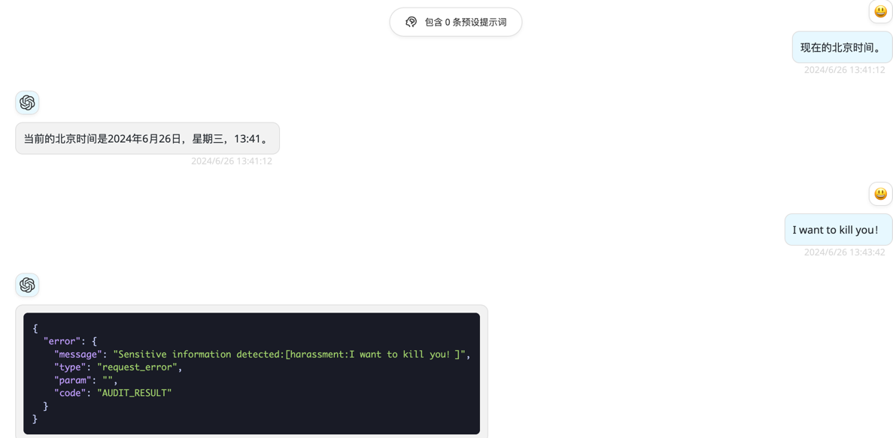

<div align="center">

# GPT-Content-Audit

_聚合Openai、阿里云、百度智能云、七牛云等开放平台，提供与`openai`请求格式对齐的内容审核前置服务_

</div>

## 功能

### 支持内容审核渠道

- [x] 阿里云
- [x] 百度智能云
- [x] 七牛云

### 支持`openai`对齐的接口 (支持的接口会先内容审核再转发，不支持的接口会直接转发)

- [x] `v1/chat/completions` 用户输入的内容审查。
- [x] `v1/images/generations`用户输入的内容审查。

### 示例:

<span></span>

## 如何使用

1. 配置[环境变量](#环境变量)并[部署](#部署)本项目。
2. 原`openai`请求地址更换为该服务请求地址即可。

## 部署

### 基于 Docker-Compose(All In One) 进行部署

```shell
docker-compose pull && docker-compose up -d
```

#### docker-compose.yml

```docker
version: '3.4'

services:
  gpt-content-audit:
    image: deanxv/gpt-content-audit:latest
    container_name: gpt-content-audit
    restart: always
    ports:
      - "7088:7088"
    volumes:
      - ./data:/app/gpt-content-audit/data
    environment:
      - AUDIT_CHANNEL_TYPE=ali          # 修改为支持的审核渠道类型
      - BASE_URL=https://api.openai.com # 修改为转发后的请求域名或IP:端口
      - API_KEY=123456            # 修改为转发后的请求地址支持的APIKey
      - TZ=Asia/Shanghai
```

### 基于 Docker 进行部署

```docker
docker run --name gpt-content-audit -d --restart always \
-p 7088:7088 \
-v $(pwd)/data:/app/gpt-content-audit/data \
-e AUDIT_CHANNEL_TYPE=ali \
-e BASE_URL=https://api.openai.com \
-e API_KEY=123456 \
-e TZ=Asia/Shanghai \
deanxv/gpt-content-audit
```

其中`AUDIT_CHANNEL_TYPE`,`BASE_URL`,`API_KEY`按照自己的需求修改，还需参考[环境变量](#环境变量)配置渠道环境变量。

如果上面的镜像无法拉取,可以尝试使用 GitHub 的 Docker 镜像,将上面的`deanxv/gpt-content-audit`替换为`ghcr.io/deanxv/gpt-content-audit`即可。

### 部署到第三方平台

<details>
<summary><strong>部署到 Zeabur</strong></summary>
<div>

> Zeabur 的服务器在国外,自动解决了网络的问题,有一定的免费使用额度。

或手动部署:

1. 首先 **fork** 一份代码。
2. 进入 [Zeabur](https://zeabur.com?referralCode=deanxv),使用github登录,进入控制台。
3. 在 Service -> Add Service,选择 Git（第一次使用需要先授权）,选择你 fork 的仓库。
4. Deploy 会自动开始,先取消。
5. 添加环境变量

   `AUDIT_CHANNEL_TYPE:ali`  修改为支持的审核渠道类型

   `BASE_URL:https://api.openai.com`  修改为转发后的请求域名或IP:端口

   `API_KEY:123456`  修改为转发后的请求地址支持的APIKey

还需参考[环境变量](#环境变量)配置渠道环境变量

保存。

6. 选择 Redeploy。

</div>


</details>

<details>
<summary><strong>部署到 Render</strong></summary>
<div>

> Render 提供免费额度,绑卡后可以进一步提升额度

Render 可以直接部署 docker 镜像,不需要 fork 仓库：[Render](https://dashboard.render.com)

</div>
</details>

## 配置

### 环境变量

#### 通用

|        变量参数        |                        变量描述                         | 是否必填 | 
|:------------------:|:---------------------------------------------------:|:----:|
| AUDIT_CHANNEL_TYPE |   审核渠道类型[openai:openai、ali:阿里、baidu:百度、qiniu:七牛]    |  Y   |  
|      BASE_URL      | 审核通过后的转发接口请求地址域名或IP:端口（例如: https://api.openai.com ） |  Y   |
|      API_KEY       |           鉴权密钥，与转发接口的API-Key保持一致，多个以`,`分隔           |  Y   |
|       ENABLE       |               审核启用开关[0:关闭、1:打开]（默认:1）               |  N   |

#### 审核渠道-Openai [Openai-内容审核](https://platform.openai.com/docs/api-reference/moderations/create)

**🌟Openai的内容审核接口不消耗API额度**

|                  变量参数                  |                                                                                    变量描述                                                                                    | 是否必填 | 
|:--------------------------------------:|:--------------------------------------------------------------------------------------------------------------------------------------------------------------------------:|:----:|
|       OPENAI_MODERATION_BASE_URL       |                                                             Openai内容审核请求域名或ip:端口（例如: https://api.openai.com ）                                                              |  Y   |  
|       OPENAI_MODERATION_API_KEY        |                                                                               Openai-API-Key                                                                               |  Y   |
|        OPENAI_MODERATION_LABEL         | 内容审核类型[sexual、hate、harassment、self-harm、sexual-minors、hate-threatening、violence-graphic、self-harm-intent、self-harm-instruction、harassment-threatening、violence]（多个以`,`分隔 ） |  Y   |
| OPENAI_MODERATION_AUDIT_CONTENT_LENGTH |                                                                            审核文本切割字节长度（默认:4000）                                                                             |  N   |

#### 审核渠道-阿里云 [阿里云-内容审核](https://vision.console.aliyun.com/cn-shanghai/detail/imageaudit)

|           变量参数           |                                                变量描述                                                | 是否必填 | 
|:------------------------:|:--------------------------------------------------------------------------------------------------:|:----:|
|    ALI_ACCESS_KEY_ID     |                                           阿里云AccessKeyId                                           |  Y   |  
|  ALI_ACCESS_KEY_SECRET   |                                         阿里云AccessKeySecret                                         |  Y   |
|       ALI_ENDPOINT       |                                            阿里云Endpoint                                             |  Y   |
|        ALI_LABEL         | 内容审核类型[spam:垃圾、politics:敏感、abuse:辱骂、terrorism:暴恐、porn:鉴黄、flood:灌水、contraband:违禁、ad:广告] （多个以`,`分隔 ） |  Y   |
| ALI_AUDIT_CONTENT_LENGTH |                                        审核文本切割字节长度[默认:4000]                                         |  N   |

#### 审核渠道-百度智能云 [百度智能云-内容审核平台](https://ai.baidu.com/censoring#/strategylist)

|            变量参数            |                                                        变量描述                                                         | 是否必填 | 
|:--------------------------:|:-------------------------------------------------------------------------------------------------------------------:|:----:|
|       BAIDU_API_KEY        |                                                     百度智能云APIKey                                                     |  Y   |  
|      BAIDU_SECRET_KEY      |                                                   百度智能云SecretKey                                                    |  Y   |
|        BAIDU_LABEL         | 内容审核类型[default:默认违禁词库、politics:政治敏感、abuse:低俗辱骂、terrorism:暴恐违禁、porn:文本色情、flood:低质灌水、ad:恶意推广、black:自定义黑名单]（多个以`,`分隔 ） |  Y   |
| BAIDU_AUDIT_CONTENT_LENGTH |                                                 审核文本切割字节长度（默认:4000）                                                 |  N   |

#### 审核渠道-七牛云 [七牛云-内容审核](https://portal.qiniu.com/censor/main/overview)

|            变量参数            |                                                         变量描述                                                         | 是否必填 | 
|:--------------------------:|:--------------------------------------------------------------------------------------------------------------------:|:----:|
|      QINIU_ACCESS_KEY      |                                                      七牛云APIKey                                                       |  Y   |  
|      QINIU_SECRET_KEY      |                                                     七牛云SecretKey                                                     |  Y   |
|        QINIU_LABEL         | 内容审核类型[spam:含垃圾信息、politics:涉政、abuse:辱骂、terrorism:暴恐、porn:色情、flood:灌水、ad:广告、contraband:违禁、meaningless:无意义]（多个以`,`分隔 ） |  Y   |
| QINIU_AUDIT_CONTENT_LENGTH |                                                 审核文本切割字节长度（默认:4000）                                                  |  N   |


